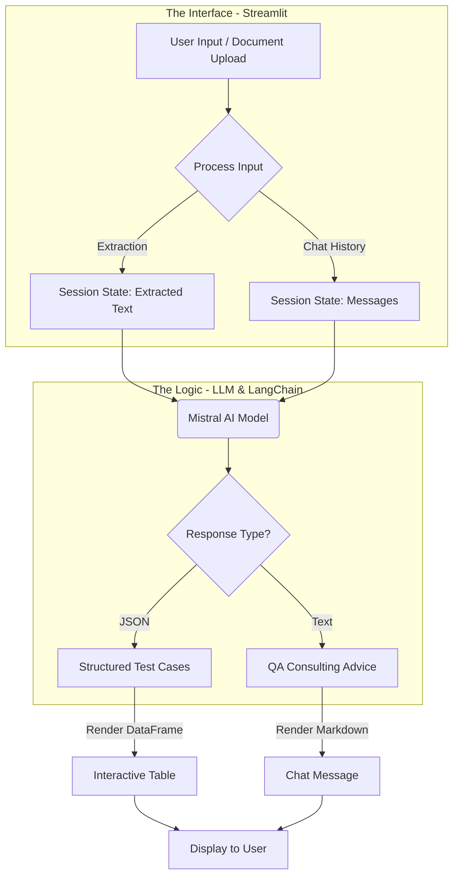
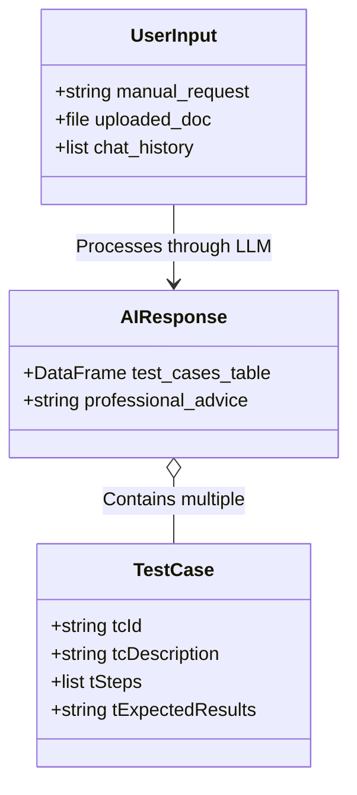

# 🧪 AI Test Case Generator

Welcome to the **AI Test Case Generator**! This tool is your personal "Senior QA Engineer" powered by Artificial Intelligence. Whether you are a developer, a product manager, or a manual tester, this app helps you transform complex requirements into structured, ready-to-use test cases in seconds.

## 🌟 What does this tool do?

Imagine you have a new feature idea or a lengthy requirement document, but you aren't sure exactly what needs to be tested. You can:
1. **Upload Documents**: Directly upload **PDF, Word, Excel, or CSV** requirement files. The tool extracts the text and uses it as context for test generation.
2. **Generate Test Cases**: Provide a requirement or use your uploaded file, and it will return a neat table of test scenarios with IDs, steps, and expected results.
3. **Consulting**: Ask follow-up questions like "What are some edge cases for this?" or "How should I test for security?" and it will respond with professional QA advice, remembering your conversation history.

---

## 🏗️ How it Works (Layman's View)

The application follows a simple "Brain & Body" structure:



---

## 🛠️ Components of the System

| Component | Role | What it does |
| :--- | :--- | :--- |
| **`app.py`** | The Interface | The "Face" of the app. Handles file uploads (PDF/Docx/Excel), chat UI, and state management. |
| **`llm.py`** | The Logic | The "Middleware". Communicates with the AI model (Mistral), parses JSON outputs, and formats DataFrames. |
| **`prompts.py`** | The Persona | The "Instructions". Defines the Senior QA Engineer persona and response rules (JSON for tables, Markdown for chat). |
| **`schemas.py`** | The Blueprint | The "Skeleton". Defines the strict structure of a Test Case (ID, Description, Steps, Results). |

---

## 💻 Tech Stack

This project leverages a modern AI stack to deliver a seamless local experience:

*   **UI Framework:** [Streamlit](https://streamlit.io/)
*   **LLM Orchestration:** [LangChain](https://www.langchain.com/) (`langchain-ollama`)
*   **AI Model:** **Mistral** (Running locally via [Ollama](https://ollama.ai/))
*   **Document Parsing:** `pypdf`, `python-docx`, `openpyxl`
*   **Data Processing:** [Pandas](https://pandas.pydata.org/)
*   **Schema Validation:** [Pydantic](https://docs.pydantic.dev/)
*   **Core Language:** **Python 3.9+**

---

## 📊 Data Relationship Diagram



---

## 🚀 Getting Started

### Prerequisites
- Python 3.9+
- [Ollama](https://ollama.ai/) installed and running locally with the `mistral` model.

### Installation
1. Clone the repository.
2. Create a virtual environment:
   ```bash
   python3 -m venv .venv
   source .venv/bin/activate
   ```
3. Install dependencies:
   ```bash
   pip install -r requirements.txt
   ```

### Running the App
Start the Streamlit server:
```bash
streamlit run app.py
```

---

## 💡 Pro Tips for Better Results
- **Upload First**: If you have a PRD or requirement doc, upload it via the sidebar first. Then just type "generate test cases" in the chat.
- **Be Specific**: Instead of "test login," try "test login with two-factor authentication and social media options."
- **Iterative Refinement**: After generating a table, ask "Can you add 3 negative test cases for this?" or "Convert these to Gherkin format."
- **Export Ready**: The tables displayed can be directly copied into Excel or Jira.

---
*Created with ❤️ for better software quality.*
