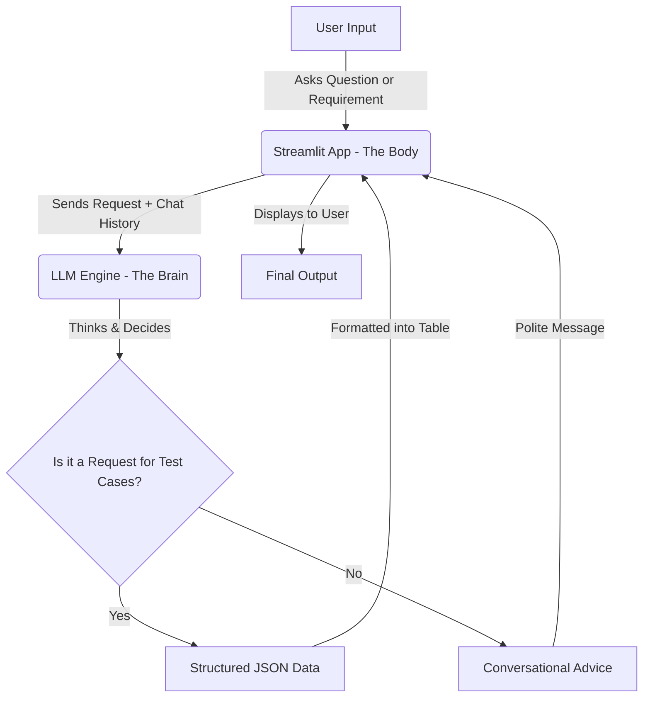
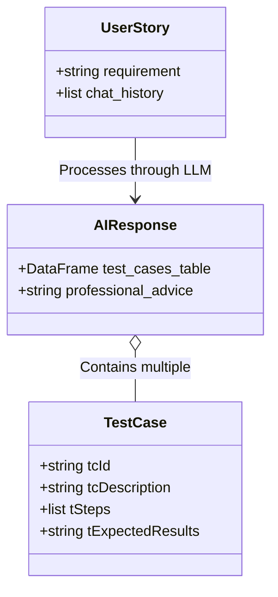

# 🧪 AI Test Case Generator

Welcome to the **AI Test Case Generator**! This tool is your personal "Senior QA Engineer" powered by Artificial Intelligence. Whether you are a developer, a product manager, or a manual tester, this app helps you transform complex requirements into structured, ready-to-use test cases in seconds.

## 🌟 What does this tool do?

Imagine you have a new feature idea (like "Web Login") but you aren't sure exactly what needs to be tested. You can simply "chat" with this tool:
1. **Generate Test Cases**: Provide a requirement, and it will return a neat table of test scenarios with IDs, steps, and expected results.
2. **Consulting**: Ask follow-up questions like "What are some edge cases for this?" or "How should I test for security?" and it will respond with professional QA advice.

---

## 🏗️ How it Works (Layman's View)

The application follows a simple "Brain & Body" structure:



---

## 🛠️ Components of the System

| Component | Role | What it does |
| :--- | :--- | :--- |
| **`app.py`** | The Interface | The "Face" of the app. It handles the chat bubbles, the tables you see, and remembers what you talked about earlier. |
| **`llm.py`** | The Logic | The "Middleware". it talks to the AI model (Mistral), cleans up the messy AI responses, and turns them into nice tables. |
| **`prompts.py`** | The Persona | The "Instructions". It tells the AI: "You are a Senior QA Engineer. Be polite. Use JSON for tables. Use text for talking." |
| **`schemas.py`** | The Blueprint | The "Skeleton". It defines exactly what a "Test Case" should look like (ID, Description, Steps, Results). |

---

## 📊 Data Relationship Diagram

This diagram shows how information is organized inside the system:



---

## 🚀 Getting Started

### Prerequisites
- Python 3.9+
- [Ollama](https://ollama.ai/) installed and running locally with the `mistral` model.

### Installation
1. Clone the repository.
2. Create a virtual environment:
   ```bash
   python3 -m venv .venv
   source .venv/bin/activate
   ```
3. Install dependencies:
   ```bash
   pip install -r requirements.txt
   ```

### Running the App
Start the Streamlit server:
```bash
streamlit run app.py
```

---

## 💡 Pro Tips for Better Results
- **Be Specific**: Instead of "test login," try "test login with two-factor authentication and social media options."
- **Ask for Edge Cases**: After generating a table, ask "Can you add 3 negative test cases for this?"
- **Format Matters**: The app automatically formats steps into numbered lists for you!

---
*Created with ❤️ for better software quality.*
